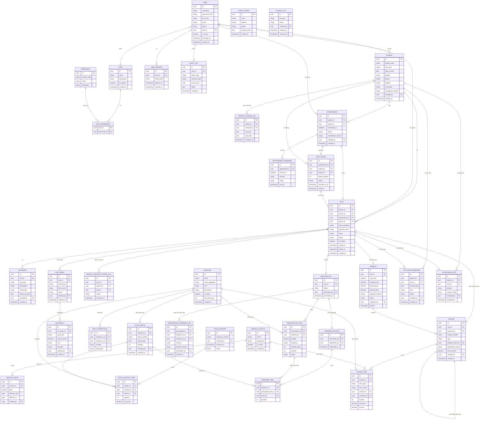

# ERD — Bệnh Án Số

```mermaid
erDiagram

  %% ───── PHÂN QUYỀN & NGƯỜI DÙNG ─────

  ROLE {
    uuid id PK
    string name
    string description
    boolean is_system
    timestamp created_at
  }

  PERMISSION {
    uuid id PK
    string feature_code
    string action
    string description
  }

  ROLE_PERMISSION {
    uuid role_id FK
    uuid permission_id FK
  }

  USER {
    uuid id PK
    string username
    string password_hash
    string full_name
    string email
    string phone
    uuid role_id FK
    boolean is_active
    timestamp last_login_at
    timestamp created_at
  }

  USER_SESSION {
    uuid id PK
    uuid user_id FK
    string token_hash
    timestamp expires_at
    timestamp created_at
  }

  AUDIT_LOG {
    uuid id PK
    uuid user_id FK
    string action_type
    string resource_type
    uuid resource_id
    json detail
    timestamp created_at
  }

  %% ───── HỒ SƠ BỆNH NHÂN ─────

  PATIENT {
    uuid id PK
    string patient_code
    string full_name
    date date_of_birth
    string gender
    string phone
    string address
    string id_number
    string emergency_contact
    uuid created_by FK
    timestamp created_at
  }

  PATIENT_CHANGE_LOG {
    uuid id PK
    uuid patient_id FK
    uuid changed_by FK
    json old_data
    json new_data
    timestamp changed_at
  }

  %% ───── DANH MỤC DỊCH VỤ & GIÁ ─────

  SERVICE_CATALOG {
    uuid id PK
    string name
    string description
    boolean is_active
    timestamp created_at
  }

  SERVICE_PRICE {
    uuid id PK
    uuid service_id FK
    decimal price
    date effective_from
    date effective_to
    uuid created_by FK
  }

  %% ───── LỊCH HẸN & HÀNG ĐỢI ─────

  APPOINTMENT {
    uuid id PK
    uuid patient_id FK
    uuid doctor_id FK
    datetime scheduled_at
    string status
    string cancellation_reason
    uuid created_by FK
    timestamp created_at
  }

  APPOINTMENT_REMINDER {
    uuid id PK
    uuid appointment_id FK
    datetime remind_at
    string channel
    string status
    timestamp sent_at
  }

  VISIT_QUEUE {
    uuid id PK
    uuid appointment_id FK
    uuid patient_id FK
    uuid doctor_id FK
    int queue_number
    string status
    timestamp checked_in_at
    timestamp called_at
  }

  %% ───── BỆNH ÁN ĐIỆN TỬ ─────

  VISIT {
    uuid id PK
    uuid patient_id FK
    uuid doctor_id FK
    uuid appointment_id FK
    uuid queue_id FK
    string chief_complaint
    string physical_exam
    string notes
    string status
    boolean is_locked
    timestamp started_at
    timestamp ended_at
    timestamp created_at
  }

  DIAGNOSIS {
    uuid id PK
    uuid visit_id FK
    string icd_code
    string description
    string instructions
    date follow_up_date
    uuid created_by FK
    timestamp created_at
  }

  LAB_ORDER {
    uuid id PK
    uuid visit_id FK
    string order_type
    string item_name
    string status
    uuid ordered_by FK
    timestamp ordered_at
  }

  LAB_RESULT {
    uuid id PK
    uuid lab_order_id FK
    string value_text
    decimal value_numeric
    string unit
    string file_path
    uuid entered_by FK
    timestamp entered_at
  }

  MEDICAL_RECORD_ACCESS_LOG {
    uuid id PK
    uuid user_id FK
    uuid patient_id FK
    uuid visit_id FK
    string action
    timestamp accessed_at
  }

  %% ───── KÊ ĐƠN THUỐC ─────

  MEDICINE {
    uuid id PK
    string name
    string active_ingredient
    string unit
    string description
    boolean is_active
    int min_stock_qty
    timestamp created_at
  }

  DRUG_INTERACTION {
    uuid id PK
    uuid medicine_a_id FK
    uuid medicine_b_id FK
    string severity
    string description
  }

  PRESCRIPTION {
    uuid id PK
    uuid visit_id FK
    string status
    uuid prescribed_by FK
    timestamp prescribed_at
  }

  PRESCRIPTION_ITEM {
    uuid id PK
    uuid prescription_id FK
    uuid medicine_id FK
    decimal dosage
    string frequency
    int duration_days
    int quantity
    string notes
  }

  PRESCRIPTION_WARNING_LOG {
    uuid id PK
    uuid prescription_id FK
    uuid medicine_a_id FK
    uuid medicine_b_id FK
    string severity
    string override_reason
    uuid overridden_by FK
    timestamp created_at
  }

  %% ───── KHO THUỐC & CẤP PHÁT ─────

  STOCK_BATCH {
    uuid id PK
    uuid medicine_id FK
    string batch_number
    date expiry_date
    int quantity
    uuid received_by FK
    timestamp received_at
  }

  STOCK_RECEIPT {
    uuid id PK
    string reference_number
    uuid received_by FK
    timestamp received_at
    string notes
  }

  STOCK_RECEIPT_ITEM {
    uuid id PK
    uuid receipt_id FK
    uuid medicine_id FK
    uuid batch_id FK
    int quantity
    decimal unit_price
  }

  DISPENSE_RECORD {
    uuid id PK
    uuid prescription_id FK
    uuid dispensed_by FK
    timestamp dispensed_at
  }

  DISPENSE_ITEM {
    uuid id PK
    uuid dispense_id FK
    uuid prescription_item_id FK
    uuid batch_id FK
    int quantity
  }

  %% ───── THU PHÍ & HÓA ĐƠN ─────

  PAYMENT {
    uuid id PK
    uuid visit_id FK
    decimal exam_fee
    decimal medicine_fee
    decimal total_amount
    decimal amount_paid
    string payment_method
    string status
    uuid collected_by FK
    timestamp paid_at
  }

  INVOICE {
    uuid id PK
    uuid visit_id FK
    uuid payment_id FK
    string invoice_number
    string type
    uuid original_invoice_id FK
    string adjustment_reason
    decimal total_amount
    uuid created_by FK
    timestamp created_at
  }

  INVOICE_LINE {
    uuid id PK
    uuid invoice_id FK
    string item_type
    string item_name
    uuid service_id FK
    uuid medicine_id FK
    int quantity
    decimal unit_price
    decimal amount
  }

  %% ───── CHĂM SÓC SAU KHÁM ─────

  FOLLOWUP_REMINDER {
    uuid id PK
    uuid patient_id FK
    uuid visit_id FK
    date remind_date
    string note
    string status
    uuid created_by FK
    timestamp created_at
  }

  AFTERCARE_NOTE {
    uuid id PK
    uuid patient_id FK
    uuid visit_id FK
    string content
    string contact_result
    uuid recorded_by FK
    timestamp recorded_at
  }

  %% ───── CẤU HÌNH & SAO LƯU ─────

  CLINIC_CONFIG {
    uuid id PK
    string name
    string address
    string phone
    json working_hours
    timestamp created_at
  }

  BACKUP_LOG {
    uuid id PK
    string file_path
    string status
    uuid created_by FK
    timestamp created_at
    timestamp restored_at
  }

  %% ═══════════════════════════════════
  %% QUAN HỆ
  %% ═══════════════════════════════════

  ROLE ||--o{ ROLE_PERMISSION : "có"
  PERMISSION ||--o{ ROLE_PERMISSION : "gán cho"
  USER }o--|| ROLE : "thuộc"
  USER ||--o{ USER_SESSION : "có"
  USER ||--o{ AUDIT_LOG : "tạo ra"

  USER ||--o{ PATIENT : "tạo bởi"
  PATIENT ||--o{ PATIENT_CHANGE_LOG : "được theo dõi"

  SERVICE_CATALOG ||--o{ SERVICE_PRICE : "có giá"

  PATIENT ||--o{ APPOINTMENT : "đặt"
  USER ||--o{ APPOINTMENT : "phụ trách"
  APPOINTMENT ||--o{ APPOINTMENT_REMINDER : "có nhắc"
  APPOINTMENT ||--o| VISIT_QUEUE : "dẫn đến"
  PATIENT ||--o{ VISIT_QUEUE : "xếp hàng"

  PATIENT ||--o{ VISIT : "có"
  USER ||--o{ VISIT : "thực hiện"
  APPOINTMENT ||--o| VISIT : "từ lịch"
  VISIT_QUEUE ||--o| VISIT : "kích hoạt"

  VISIT ||--o{ DIAGNOSIS : "có"
  VISIT ||--o{ LAB_ORDER : "có chỉ định"
  LAB_ORDER ||--o{ LAB_RESULT : "có kết quả"
  VISIT ||--o{ MEDICAL_RECORD_ACCESS_LOG : "được truy cập"

  VISIT ||--o| PRESCRIPTION : "có đơn"
  PRESCRIPTION ||--o{ PRESCRIPTION_ITEM : "chứa"
  MEDICINE ||--o{ PRESCRIPTION_ITEM : "dùng trong"
  MEDICINE ||--o{ DRUG_INTERACTION : "liên quan"
  PRESCRIPTION ||--o{ PRESCRIPTION_WARNING_LOG : "phát sinh cảnh báo"

  MEDICINE ||--o{ STOCK_BATCH : "tồn kho theo lô"
  STOCK_RECEIPT ||--o{ STOCK_RECEIPT_ITEM : "chứa"
  MEDICINE ||--o{ STOCK_RECEIPT_ITEM : "bao gồm"
  STOCK_BATCH ||--o{ STOCK_RECEIPT_ITEM : "thuộc lô"

  PRESCRIPTION ||--o| DISPENSE_RECORD : "được cấp phát"
  DISPENSE_RECORD ||--o{ DISPENSE_ITEM : "chứa"
  PRESCRIPTION_ITEM ||--o{ DISPENSE_ITEM : "được thực hiện"
  STOCK_BATCH ||--o{ DISPENSE_ITEM : "tiêu thụ từ"

  VISIT ||--o| PAYMENT : "được thu phí"
  VISIT ||--o{ INVOICE : "được lập hóa đơn"
  PAYMENT ||--o{ INVOICE : "liên kết"
  INVOICE ||--o{ INVOICE_LINE : "chứa"
  SERVICE_CATALOG ||--o{ INVOICE_LINE : "tham chiếu"
  MEDICINE ||--o{ INVOICE_LINE : "tham chiếu"
  INVOICE ||--o| INVOICE : "được điều chỉnh bởi"

  PATIENT ||--o{ FOLLOWUP_REMINDER : "có lịch nhắc"
  VISIT ||--o{ FOLLOWUP_REMINDER : "từ lượt khám"
  PATIENT ||--o{ AFTERCARE_NOTE : "có ghi nhận"
  VISIT ||--o{ AFTERCARE_NOTE : "từ lượt khám"
```
